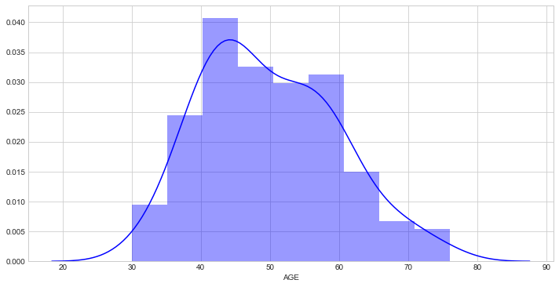
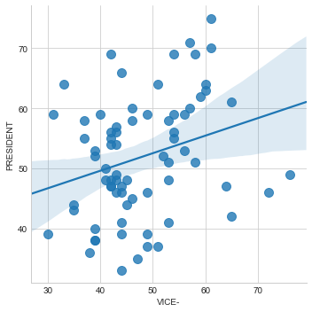

# Loading Data


```python
import numpy as np
import pandas as pd
import seaborn as sns
import matplotlib.pylab as plt
```


```python
sns.set_style('whitegrid')
sns.set_context(font_scale=1.2)
```


```python
pres_cdt = pd.read_csv('2019-GENERAL-ELECTIONS-FINAL-LIST-OF-PRESIDENTIAL-CANDIDATES.csv',index_col=0)
```

# Preliminary Data Exploration


```python
pres_cdt.head()
```


<div>
<style scoped>
    .dataframe tbody tr th:only-of-type {
        vertical-align: middle;
    }

    .dataframe tbody tr th {
        vertical-align: top;
    }

    .dataframe thead th {
        text-align: right;
    }
</style>
<table border="1" class="dataframe">
  <thead>
    <tr style="text-align: right;">
      <th></th>
      <th>POSITION</th>
      <th>NAME OF CANDIDATE</th>
      <th>PARTY</th>
      <th>PWD</th>
      <th>AGE</th>
      <th>GENDER</th>
      <th>QUALIFICATION</th>
      <th>REMARKS</th>
      <th>STATE OF ORIGIN</th>
      <th>Twitter Handle</th>
      <th>Official Website</th>
    </tr>
    <tr>
      <th>SN</th>
      <th></th>
      <th></th>
      <th></th>
      <th></th>
      <th></th>
      <th></th>
      <th></th>
      <th></th>
      <th></th>
      <th></th>
      <th></th>
    </tr>
  </thead>
  <tbody>
    <tr>
      <th>1</th>
      <td>PRESIDENT</td>
      <td>OSITELU  ISAAC BABATUNDE</td>
      <td>A</td>
      <td>None</td>
      <td>64.0</td>
      <td>M</td>
      <td>FSLC, BSc, WASC, MSc</td>
      <td>NaN</td>
      <td>NaN</td>
      <td>NaN</td>
      <td>NaN</td>
    </tr>
    <tr>
      <th>2</th>
      <td>VICE-</td>
      <td>LAWAL NAFIU MUHAMMAD</td>
      <td>A</td>
      <td>None</td>
      <td>33.0</td>
      <td>M</td>
      <td>FSLC, BSc, NECO</td>
      <td>NaN</td>
      <td>NaN</td>
      <td>NaN</td>
      <td>NaN</td>
    </tr>
    <tr>
      <th>3</th>
      <td>PRESIDENT</td>
      <td>ABDULRASHID HASSAN BABA</td>
      <td>AA</td>
      <td>None</td>
      <td>46.0</td>
      <td>M</td>
      <td>SSCE</td>
      <td>NaN</td>
      <td>NaN</td>
      <td>NaN</td>
      <td>NaN</td>
    </tr>
    <tr>
      <th>4</th>
      <td>VICE-</td>
      <td>UCHENDU UJU PEACE OZOKA</td>
      <td>AA</td>
      <td>None</td>
      <td>49.0</td>
      <td>F</td>
      <td>LLB</td>
      <td>NaN</td>
      <td>NaN</td>
      <td>NaN</td>
      <td>NaN</td>
    </tr>
    <tr>
      <th>5</th>
      <td>PRESIDENT</td>
      <td>OMOYELE SOWORE</td>
      <td>AAC</td>
      <td>None</td>
      <td>47.0</td>
      <td>M</td>
      <td>WAEC</td>
      <td>NaN</td>
      <td>NaN</td>
      <td>NaN</td>
      <td>NaN</td>
    </tr>
  </tbody>
</table>
</div>


```python
del pres_cdt['PWD']
pres_cdt.dropna(axis=1,inplace=True,how='all')
pres_cdt.dropna(axis=0,inplace=True,)
pres_cdt.reset_index(inplace=True)
```


```python
pres_cdt.info()
```

    <class 'pandas.core.frame.DataFrame'>
    RangeIndex: 144 entries, 0 to 143
    Data columns (total 7 columns):
    SN                   144 non-null int64
    POSITION             144 non-null object
    NAME OF CANDIDATE    144 non-null object
    PARTY                144 non-null object
    AGE                  144 non-null float64
    GENDER               144 non-null object
    QUALIFICATION        144 non-null object
    dtypes: float64(1), int64(1), object(5)
    memory usage: 8.0+ KB
    

# Data Cleaning and Feature Engineering

In this section, I tried to group the qualifications into meaningful subgroups. I then used a series of hierarchical for loops to map each candidates to a 'highest level of education' feature.

P.S: I know there may be more Pythonic ways to do this. I would love to see your improvements.

## Data Cleaning


```python
z=pres_cdt['QUALIFICATION'].str.split(',')
```


```python
ls = z[1]
for i in range(2, len(z)):
    for x in z[i]:
            ls.append(x)
```


```python
lst=list(set(list((','.join(ls)).lower().split(','))))
```


```python
print(lst)
print(len(lst))
```

    [' ll.m', '', 'wasc', 'pgd', ' bsc', ' wasc o&a', ' it fm (mba)', 'mbbs', ' mph', 'ssce', ' hnd', '  bl', ' ma', 'hnd', 'nce', ' ol', ' mba', ' pgd', 'p.', 'bed', ' nce', 'nd', 'hdpa', ' cdt', ' wasc', 'waec', ' executive certificate', ' bed', 'bl', ' waec', ' ps', ' nda cert', ' llb', ' ond', ' btech', ' pharm. d', ' dip', ' b.sc', ' hsc', 'diploma', 'ond', ' nabteb', 'phd', ' neco', ' ba', 'fnipr', ' nd', ' od', 'dba', ' ssce', ' mba mphil', ' gce', ' al', ' bsc.', ' diploma', ' llm', 'llb', ' msc', 'b.phil', ' juris doctor', ' phd', 'msc', 'ba', ' b.eng', 'bsc', ' bl', 'fslc']
    67
    


```python
lst = [i.strip() for i in lst]
lst=list(set(lst))
print(lst)
print(len(lst))
```

    ['', 'nabteb', 'pgd', 'wasc', 'll.m', 'juris doctor', 'btech', 'mbbs', 'ssce', 'mph', 'nce', 'hnd', 'p.', 'nd', 'ma', 'pharm. d', 'bsc.', 'ps', 'bed', 'hdpa', 'waec', 'bl', 'od', 'al', 'executive certificate', 'mba mphil', 'b.eng', 'diploma', 'ond', 'phd', 'fnipr', 'dba', 'neco', 'gce', 'llm', 'mba', 'nda cert', 'cdt', 'llb', 'b.sc', 'dip', 'b.phil', 'ba', 'msc', 'hsc', 'bsc', 'it fm (mba)', 'wasc o&a', 'ol', 'fslc']
    50
    


```python
lst.remove('')
```


```python
uni = ['nda cert']
for i in lst:
#    i = i.strip()
    if i.startswith('b')==True or i=='mbbs' or i=='ll.m' or i=='llb' or i =='llm' or i == 'pharm. d' :
        uni.append(i)
lst=list(set(lst)-set(uni)) 
```


```python
ps = ['fslc']
ss = ['neco']
for i in lst:
#    i = i.strip()
    if i.startswith('w')==True  or i.startswith('g') or i.startswith('s'):
        ss.append(i)
lst=list(set(lst)-set(ps)-set(ss)) 
```


```python
pg = []
for i in lst:
#    i = i.strip()
    if i.startswith('m')==True or i == 'it fm (mba)' or i == 'pgd':
        pg.append(i)
lst=list(set(lst)-set(pg)) 
```


```python
ond = ['ond','diploma','nd']
hnd = ['hnd']
phd = ['phd']
nce=['nce']
```


```python
others=list(set(lst)-set(ond)-set(hnd)-set(phd)-set(nce)) 
```


```python
print(others,'\n',ond,'\n',hnd,'\n',phd,'\n',pg,'\n',ps,'\n',uni,'\n',ss,'\n',nce)
```

    ['nabteb', 'cdt', 'juris doctor', 'fnipr', 'dba', 'dip', 'od', 'p.', 'al', 'hsc', 'executive certificate', 'ps', 'ol', 'hdpa'] 
     ['ond', 'diploma', 'nd'] 
     ['hnd'] 
     ['phd'] 
     ['pgd', 'mph', 'ma', 'mba mphil', 'mba', 'msc', 'it fm (mba)'] 
     ['fslc'] 
     ['nda cert', 'll.m', 'btech', 'mbbs', 'pharm. d', 'bsc.', 'bed', 'bl', 'b.eng', 'llm', 'llb', 'b.sc', 'b.phil', 'ba', 'bsc'] 
     ['neco', 'wasc', 'ssce', 'waec', 'gce', 'wasc o&a'] 
     ['nce']
    

## Feature Engineering


```python
cer=dict()
for i in ','.join(others).split(','):
    for j in pres_cdt['QUALIFICATION'].index:
        if i in pres_cdt['QUALIFICATION'][j].lower():
           cer[j]='Others'
        else:
            cer[j]='x'
```


```python
for i in ','.join(phd).split(','):
    for key in cer.keys():
        if i in pres_cdt['QUALIFICATION'][key].lower() and cer[key]=='x':
           cer[key]='Doctorate'
```


```python
for i in ','.join(pg).split(','):
    for key in cer.keys():
        if i in pres_cdt['QUALIFICATION'][key].lower() and cer[key]=='x':
           cer[key]='Postgraduate'
```


```python
for i in ','.join(uni).split(','):
    for key in cer.keys():
        if i in pres_cdt['QUALIFICATION'][key].lower() and cer[key]=='x':
           cer[key]='University'
```


```python
for i in ','.join(hnd).split(','):
    for key in cer.keys():
        if i in pres_cdt['QUALIFICATION'][key].lower() and cer[key]=='x':
           cer[key]='HND'
```


```python
for i in ','.join(nce).split(','):
    for key in cer.keys():
        if i in pres_cdt['QUALIFICATION'][key].lower() and cer[key]=='x':
           cer[key]='NCE'
```


```python
for i in ','.join(ond).split(','):
    for key in cer.keys():
        if i in pres_cdt['QUALIFICATION'][key].lower() and cer[key]=='x':
           cer[key]='OND'
```


```python
for i in ','.join(ss).split(','):
    for key in cer.keys():
        if i in pres_cdt['QUALIFICATION'][key].lower() and cer[key]=='x':
           cer[key]='Secondary School'
```


```python
for i in ','.join(ps).split(','):
    for key in cer.keys():
        if i in pres_cdt['QUALIFICATION'][key].lower() and cer[key]=='x':
           cer[key]='Primary School'
```


```python
 for key in cer.keys():
        if cer[key]=='x':
           cer[key]='Others'
```


```python
print(cer)
```

    {0: 'Postgraduate', 1: 'University', 2: 'Secondary School', 3: 'University', 4: 'Secondary School', 5: 'Postgraduate', 6: 'University', 7: 'University', 8: 'Secondary School', 9: 'University', 10: 'University', 11: 'University', 12: 'Doctorate', 13: 'Others', 14: 'Doctorate', 15: 'Doctorate', 16: 'University', 17: 'Secondary School', 18: 'University', 19: 'Postgraduate', 20: 'Secondary School', 21: 'Secondary School', 22: 'Doctorate', 23: 'University', 24: 'Postgraduate', 25: 'Postgraduate', 26: 'University', 27: 'Secondary School', 28: 'Postgraduate', 29: 'University', 30: 'Doctorate', 31: 'Postgraduate', 32: 'Secondary School', 33: 'University', 34: 'University', 35: 'Doctorate', 36: 'Secondary School', 37: 'University', 38: 'University', 39: 'University', 40: 'Primary School', 41: 'Primary School', 42: 'Postgraduate', 43: 'Postgraduate', 44: 'University', 45: 'University', 46: 'University', 47: 'Postgraduate', 48: 'Secondary School', 49: 'NCE', 50: 'Secondary School', 51: 'University', 52: 'University', 53: 'NCE', 54: 'Postgraduate', 55: 'HND', 56: 'OND', 57: 'University', 58: 'Postgraduate', 59: 'Secondary School', 60: 'Doctorate', 61: 'HND', 62: 'University', 63: 'University', 64: 'Doctorate', 65: 'University', 66: 'Doctorate', 67: 'HND', 68: 'Postgraduate', 69: 'HND', 70: 'Secondary School', 71: 'Secondary School', 72: 'Secondary School', 73: 'OND', 74: 'Doctorate', 75: 'Doctorate', 76: 'Doctorate', 77: 'University', 78: 'Postgraduate', 79: 'Secondary School', 80: 'Doctorate', 81: 'University', 82: 'Secondary School', 83: 'HND', 84: 'Postgraduate', 85: 'NCE', 86: 'Postgraduate', 87: 'University', 88: 'HND', 89: 'Secondary School', 90: 'Postgraduate', 91: 'Secondary School', 92: 'Secondary School', 93: 'Postgraduate', 94: 'University', 95: 'Postgraduate', 96: 'OND', 97: 'University', 98: 'University', 99: 'Postgraduate', 100: 'University', 101: 'University', 102: 'University', 103: 'University', 104: 'NCE', 105: 'University', 106: 'University', 107: 'Postgraduate', 108: 'Postgraduate', 109: 'University', 110: 'OND', 111: 'University', 112: 'Postgraduate', 113: 'University', 114: 'Postgraduate', 115: 'University', 116: 'University', 117: 'OND', 118: 'Secondary School', 119: 'Secondary School', 120: 'Postgraduate', 121: 'Doctorate', 122: 'Doctorate', 123: 'Postgraduate', 124: 'HND', 125: 'University', 126: 'University', 127: 'OND', 128: 'HND', 129: 'HND', 130: 'Secondary School', 131: 'Postgraduate', 132: 'Postgraduate', 133: 'University', 134: 'University', 135: 'Postgraduate', 136: 'HND', 137: 'HND', 138: 'Doctorate', 139: 'Postgraduate', 140: 'OND', 141: 'Postgraduate', 142: 'Doctorate', 143: 'HND'}
    


```python
a=pd.DataFrame(pd.Series(cer,index=cer.keys()),columns=['Highest Education'])
```


```python
a.head()
```


<div>
<style scoped>
    .dataframe tbody tr th:only-of-type {
        vertical-align: middle;
    }

    .dataframe tbody tr th {
        vertical-align: top;
    }

    .dataframe thead th {
        text-align: right;
    }
</style>
<table border="1" class="dataframe">
  <thead>
    <tr style="text-align: right;">
      <th></th>
      <th>Highest Education</th>
    </tr>
  </thead>
  <tbody>
    <tr>
      <th>0</th>
      <td>Postgraduate</td>
    </tr>
    <tr>
      <th>1</th>
      <td>University</td>
    </tr>
    <tr>
      <th>2</th>
      <td>Secondary School</td>
    </tr>
    <tr>
      <th>3</th>
      <td>University</td>
    </tr>
    <tr>
      <th>4</th>
      <td>Secondary School</td>
    </tr>
  </tbody>
</table>
</div>


```python
del pres_cdt['QUALIFICATION']
pres_cdt=pres_cdt.join(a)
pres_cdt.reset_index(level=0,drop=True, inplace=True)
```


```python
del pres_cdt['SN']
```

# Explorative Data Analysis

## Descriptive Statistics


```python
pres_cdt.describe()
```


<div>
<style scoped>
    .dataframe tbody tr th:only-of-type {
        vertical-align: middle;
    }

    .dataframe tbody tr th {
        vertical-align: top;
    }

    .dataframe thead th {
        text-align: right;
    }
</style>
<table border="1" class="dataframe">
  <thead>
    <tr style="text-align: right;">
      <th></th>
      <th>AGE</th>
    </tr>
  </thead>
  <tbody>
    <tr>
      <th>count</th>
      <td>144.000000</td>
    </tr>
    <tr>
      <th>mean</th>
      <td>49.888889</td>
    </tr>
    <tr>
      <th>std</th>
      <td>9.844320</td>
    </tr>
    <tr>
      <th>min</th>
      <td>30.000000</td>
    </tr>
    <tr>
      <th>25%</th>
      <td>42.000000</td>
    </tr>
    <tr>
      <th>50%</th>
      <td>48.500000</td>
    </tr>
    <tr>
      <th>75%</th>
      <td>57.000000</td>
    </tr>
    <tr>
      <th>max</th>
      <td>76.000000</td>
    </tr>
  </tbody>
</table>
</div>


```python
pres_cdt[pres_cdt['AGE']==30]
```


<div>
<style scoped>
    .dataframe tbody tr th:only-of-type {
        vertical-align: middle;
    }

    .dataframe tbody tr th {
        vertical-align: top;
    }

    .dataframe thead th {
        text-align: right;
    }
</style>
<table border="1" class="dataframe">
  <thead>
    <tr style="text-align: right;">
      <th></th>
      <th>POSITION</th>
      <th>NAME OF CANDIDATE</th>
      <th>PARTY</th>
      <th>AGE</th>
      <th>GENDER</th>
      <th>Highest Education</th>
    </tr>
  </thead>
  <tbody>
    <tr>
      <th>103</th>
      <td>VICE-</td>
      <td>JOHNSON OMEDE</td>
      <td>NNPP</td>
      <td>30.0</td>
      <td>M</td>
      <td>University</td>
    </tr>
  </tbody>
</table>
</div>


```python
pres_cdt[pres_cdt['AGE']==76]
```


<div>
<style scoped>
    .dataframe tbody tr th:only-of-type {
        vertical-align: middle;
    }

    .dataframe tbody tr th {
        vertical-align: top;
    }

    .dataframe thead th {
        text-align: right;
    }
</style>
<table border="1" class="dataframe">
  <thead>
    <tr style="text-align: right;">
      <th></th>
      <th>POSITION</th>
      <th>NAME OF CANDIDATE</th>
      <th>PARTY</th>
      <th>AGE</th>
      <th>GENDER</th>
      <th>Highest Education</th>
    </tr>
  </thead>
  <tbody>
    <tr>
      <th>121</th>
      <td>VICE-</td>
      <td>AGWUNCHA NWANKWO ARTHUR</td>
      <td>PT</td>
      <td>76.0</td>
      <td>M</td>
      <td>Doctorate</td>
    </tr>
  </tbody>
</table>
</div>


We can see that the youngest and oldest people participating in the presidential elections are both vice-presidential candidates. Let us try to split the data into just presidential and vice-presidential candidates. The mean age is about 50 years for all the candidates.


```python
pres_only=pres_cdt[pres_cdt['POSITION']=='PRESIDENT']
vice_only=pres_cdt[pres_cdt['POSITION']=='VICE-']
```


```python
pres_only.describe()
```


<div>
<style scoped>
    .dataframe tbody tr th:only-of-type {
        vertical-align: middle;
    }

    .dataframe tbody tr th {
        vertical-align: top;
    }

    .dataframe thead th {
        text-align: right;
    }
</style>
<table border="1" class="dataframe">
  <thead>
    <tr style="text-align: right;">
      <th></th>
      <th>AGE</th>
    </tr>
  </thead>
  <tbody>
    <tr>
      <th>count</th>
      <td>72.000000</td>
    </tr>
    <tr>
      <th>mean</th>
      <td>51.902778</td>
    </tr>
    <tr>
      <th>std</th>
      <td>9.892606</td>
    </tr>
    <tr>
      <th>min</th>
      <td>33.000000</td>
    </tr>
    <tr>
      <th>25%</th>
      <td>45.750000</td>
    </tr>
    <tr>
      <th>50%</th>
      <td>51.500000</td>
    </tr>
    <tr>
      <th>75%</th>
      <td>59.000000</td>
    </tr>
    <tr>
      <th>max</th>
      <td>75.000000</td>
    </tr>
  </tbody>
</table>
</div>


The average of presidential candidates is about 52 years. While it might be true that leading candidates are much older, the average age is relatively young.

Let us take a look at the youngest and oldest presidential candidates and their portfolios.


```python
print('Oldest presidential candidate is:')
pres_only[pres_only['AGE']==75]
```

    Oldest presidential candidate is:
    


<div>
<style scoped>
    .dataframe tbody tr th:only-of-type {
        vertical-align: middle;
    }

    .dataframe tbody tr th {
        vertical-align: top;
    }

    .dataframe thead th {
        text-align: right;
    }
</style>
<table border="1" class="dataframe">
  <thead>
    <tr style="text-align: right;">
      <th></th>
      <th>POSITION</th>
      <th>NAME OF CANDIDATE</th>
      <th>PARTY</th>
      <th>AGE</th>
      <th>GENDER</th>
      <th>Highest Education</th>
    </tr>
  </thead>
  <tbody>
    <tr>
      <th>32</th>
      <td>PRESIDENT</td>
      <td>BUHARI MUHAMMADU</td>
      <td>APC</td>
      <td>75.0</td>
      <td>M</td>
      <td>Secondary School</td>
    </tr>
  </tbody>
</table>
</div>


```python
print('Youngest presidential candidate is:')
pres_only[pres_only['AGE']==33]
```

    Youngest presidential candidate is:
    


<div>
<style scoped>
    .dataframe tbody tr th:only-of-type {
        vertical-align: middle;
    }

    .dataframe tbody tr th {
        vertical-align: top;
    }

    .dataframe thead th {
        text-align: right;
    }
</style>
<table border="1" class="dataframe">
  <thead>
    <tr style="text-align: right;">
      <th></th>
      <th>POSITION</th>
      <th>NAME OF CANDIDATE</th>
      <th>PARTY</th>
      <th>AGE</th>
      <th>GENDER</th>
      <th>Highest Education</th>
    </tr>
  </thead>
  <tbody>
    <tr>
      <th>126</th>
      <td>PRESIDENT</td>
      <td>NSEHE NSEOBONG</td>
      <td>RP</td>
      <td>33.0</td>
      <td>M</td>
      <td>University</td>
    </tr>
  </tbody>
</table>
</div>


```python
vice_only.describe()
```


<div>
<style scoped>
    .dataframe tbody tr th:only-of-type {
        vertical-align: middle;
    }

    .dataframe tbody tr th {
        vertical-align: top;
    }

    .dataframe thead th {
        text-align: right;
    }
</style>
<table border="1" class="dataframe">
  <thead>
    <tr style="text-align: right;">
      <th></th>
      <th>AGE</th>
    </tr>
  </thead>
  <tbody>
    <tr>
      <th>count</th>
      <td>72.000000</td>
    </tr>
    <tr>
      <th>mean</th>
      <td>47.875000</td>
    </tr>
    <tr>
      <th>std</th>
      <td>9.439112</td>
    </tr>
    <tr>
      <th>min</th>
      <td>30.000000</td>
    </tr>
    <tr>
      <th>25%</th>
      <td>42.000000</td>
    </tr>
    <tr>
      <th>50%</th>
      <td>45.000000</td>
    </tr>
    <tr>
      <th>75%</th>
      <td>54.000000</td>
    </tr>
    <tr>
      <th>max</th>
      <td>76.000000</td>
    </tr>
  </tbody>
</table>
</div>


The average of vice-presidential candidates is about 48 years. While it might be true that leading candidates are much older, the average age is relatively young.

Let us take a look at the youngest and oldest presidential candidates and their portfolios.


```python
print('Youngest vice-presidential candidate is:')
vice_only[vice_only['AGE']==30]
```

    Youngest vice-presidential candidate is:
    


<div>
<style scoped>
    .dataframe tbody tr th:only-of-type {
        vertical-align: middle;
    }

    .dataframe tbody tr th {
        vertical-align: top;
    }

    .dataframe thead th {
        text-align: right;
    }
</style>
<table border="1" class="dataframe">
  <thead>
    <tr style="text-align: right;">
      <th></th>
      <th>POSITION</th>
      <th>NAME OF CANDIDATE</th>
      <th>PARTY</th>
      <th>AGE</th>
      <th>GENDER</th>
      <th>Highest Education</th>
    </tr>
  </thead>
  <tbody>
    <tr>
      <th>103</th>
      <td>VICE-</td>
      <td>JOHNSON OMEDE</td>
      <td>NNPP</td>
      <td>30.0</td>
      <td>M</td>
      <td>University</td>
    </tr>
  </tbody>
</table>
</div>


```python
print('Oldest vice-presidential candidate is:')
vice_only[vice_only['AGE']==76]
```

    Oldest vice-presidential candidate is:
    


<div>
<style scoped>
    .dataframe tbody tr th:only-of-type {
        vertical-align: middle;
    }

    .dataframe tbody tr th {
        vertical-align: top;
    }

    .dataframe thead th {
        text-align: right;
    }
</style>
<table border="1" class="dataframe">
  <thead>
    <tr style="text-align: right;">
      <th></th>
      <th>POSITION</th>
      <th>NAME OF CANDIDATE</th>
      <th>PARTY</th>
      <th>AGE</th>
      <th>GENDER</th>
      <th>Highest Education</th>
    </tr>
  </thead>
  <tbody>
    <tr>
      <th>121</th>
      <td>VICE-</td>
      <td>AGWUNCHA NWANKWO ARTHUR</td>
      <td>PT</td>
      <td>76.0</td>
      <td>M</td>
      <td>Doctorate</td>
    </tr>
  </tbody>
</table>
</div>


# Visualization

Let us view the distributions of the age for both the general dataset and those of the presidential & vice-presidential candidates only.


```python
plt.figure(figsize=(12,6))
sns.distplot(pres_cdt['AGE'],color='blue')
```


    <matplotlib.axes._subplots.AxesSubplot at 0x26ccb0df978>





```python
plt.figure(figsize=(12,6))
sns.distplot(pres_only['AGE'],bins=15,color='blue')
```


    <matplotlib.axes._subplots.AxesSubplot at 0x26ccb1c8c88>


```python
plt.figure(figsize=(12,6))
sns.distplot(vice_only['AGE'],bins=15,color='blue')
```


    <matplotlib.axes._subplots.AxesSubplot at 0x26ccb1ffb00>


The age distributions for all the dataset is rougly normal. Thus candidates are equally as likely to be young as to be old.

Let us now explore the age feature


```python
plt.figure(figsize=(12,6))
sns.boxplot(data=pres_cdt,x='GENDER',y='AGE',palette='seismic')
```


    <matplotlib.axes._subplots.AxesSubplot at 0x26ccb2cff60>


```python
plt.figure(figsize=(12,6))
sns.boxplot(data=pres_cdt,x='GENDER',y='AGE',hue='POSITION',palette='seismic')
```


    <matplotlib.axes._subplots.AxesSubplot at 0x26ccb281a20>


From the first plot, it can be seen that average age for all the female candidates is about five years less than that of their male counterparts. When seperated by position, it can be easily seen that while presidential candidates are generally on an average older than the vice-presidential candidates, the difference is less pronouced in males than females. It is interesting to know that the average age for female presidential candidates is about four years higher than that of male presidential candidates. Generally, the age range is lesser for female candidates than males.


```python
plt.figure(figsize=(15,7))
sns.barplot(data=pres_cdt,x='GENDER',y='AGE',hue='Highest Education')
```


    <matplotlib.axes._subplots.AxesSubplot at 0x26ccb35ba58>


There seem to be no direct relationship between the level of education and the average age of candidates with that level of education for both sexes


```python
plt.figure(figsize=(12,4))
sns.countplot(data=pres_cdt,x='GENDER',palette='seismic')
```


    <matplotlib.axes._subplots.AxesSubplot at 0x26ccb4f6518>


```python
plt.figure(figsize=(12,4))
sns.countplot(data=pres_cdt,x='GENDER',hue='POSITION',palette='seismic')
```


    <matplotlib.axes._subplots.AxesSubplot at 0x26ccb5340b8>


It is evident that there are far more men in the general candidates' list than female (about 3.5x more than females). The ratio of male presidential candidates to female is about 13:1. Most female candidates are vice-presidential candidates (about 4x more than the female presidential candidates.


```python
plt.figure(figsize=(12,4.5))
sns.countplot(data=pres_cdt,x='Highest Education')
```


    <matplotlib.axes._subplots.AxesSubplot at 0x26ccb55b6d8>


```python
plt.figure(figsize=(12,7))
sns.countplot(data=pres_cdt,x='Highest Education',hue='POSITION',palette='seismic')
```


    <matplotlib.axes._subplots.AxesSubplot at 0x26ccb5da898>


```python
plt.figure(figsize=(12,4.5))
sns.countplot(data=pres_cdt,x='Highest Education',hue='GENDER',palette='seismic')
```


    <matplotlib.axes._subplots.AxesSubplot at 0x26ccb5c1470>


The most popular level of education for all the candidates is the university education. Postgraduate comes in second while secondary school comes in third.

Exploring for the specific position, it is clear the trend still remains. Exploring for gender, it is seen that females are more likely to have a doctorate or an HND than a secondary school certificate

Finally, I pivoted the candidates list and then plotted the age of the Vice-Presidential candidates to the Presidential Candidates for each party. This helps see at a glance the parties whose candidates are generally very old or vice-versa or an interesting mix.


```python
df=pres_cdt.pivot_table(index='PARTY',values='AGE',columns='POSITION')
df.reset_index(level=0, inplace=True)
```


```python
f, (axs1,axs2) = plt.subplots(1,2,figsize=(20,15))

p1=sns.regplot(data=df[0:int(df.shape[0]/2)], y="PRESIDENT", x="VICE-", fit_reg=False, marker="+", color="red", scatter_kws={'s':200},ax=axs1)
p2=sns.regplot(data=df[int(df.shape[0]/2)-1:df.shape[0]], y="PRESIDENT", x="VICE-", fit_reg=False, marker="+", color="red", scatter_kws={'s':200},ax=axs2)

# add annotations one by one with a loop
for line in range(0,int(df.shape[0]/2)):
     p1.text(df['VICE-'][line]+0.2, df["PRESIDENT"][line]+0.1, df["PARTY"][line], horizontalalignment='left', size='large', color='black', weight='semibold')
        
for line in range(int(df.shape[0]/2)-1,df.shape[0]):
     p2.text(df['VICE-'][line]+0.2, df["PRESIDENT"][line]+0.1, df["PARTY"][line], horizontalalignment='left', size='large', color='black', weight='semibold')
```


```python
plt.figure(figsize=(20,20))
sns.lmplot(data=df, y="PRESIDENT", x="VICE-", fit_reg=True, scatter_kws={'s':100})
```


    <seaborn.axisgrid.FacetGrid at 0x26ccb6e93c8>


    <matplotlib.figure.Figure at 0x26ccb7060b8>





It can be seen that in general the higher the age of the vice-presidential candidate, the higher the age of the presidential candidate.


```python

```
